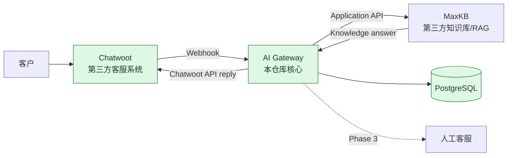

# Architecture — Phase 3

## 1. 目标与范围

Enamel AI Platform 是面向珐琅锅企业业务的 AI 应用集成 PoC。第一条计划链路是“客户消息 → 客服系统 → AI Gateway → 知识库/RAG → 客服系统”，并在不确定或高风险场景转人工。

Phase 0 建立工程底座；Phase 1 完成 Chatwoot 集成；Phase 2 增加 MaxKB 知识库调用与运行记录，不实现人工接管。

## 2. 组件关系



Phase 2 已实现 Chatwoot → Gateway → MaxKB → Gateway → Chatwoot；人工客服仍是后续阶段边界。

Phase 3 在 Gateway 内新增受控 AI/HUMAN 状态机：HUMAN 模式绕过 MaxKB，Chatwoot 使用保留原标签后追加 `human_handoff` 的官方标签 API 作 best-effort 标记。详见 [`human-handoff.md`](human-handoff.md)。

## 3. Gateway 结构

```text
apps/gateway/
├─ src/
│  ├─ app.ts          # Express 应用工厂与 /health
│  ├─ server.ts       # 进程启动入口
│  ├─ config/env.ts   # 环境变量解析
│  ├─ api/            # 轻量 HTTP controller
│  ├─ services/       # Webhook 处理与知识库回答流程
│  ├─ clients/        # Chatwoot 与 MaxKB API Client
│  └─ repositories/   # Conversation 与 ai_runs 存取
└─ tests/
   ├─ health.test.ts
   ├─ chatwoot-webhook.test.ts
   └─ chatwoot-client.test.ts
```

Phase 2 使用 `controller → service → client/repository` 分层。Human Handoff 模块尚未创建。

## 4. 关键决策

### ADR-0001：Gateway 为独立维护边界

Chatwoot 和 MaxKB 作为独立第三方服务使用 API 集成；不复制、不 fork 后魔改其核心源码。这样可以清晰说明项目自身贡献，也降低上游升级和许可证混淆风险。

### ADR-0002：单体 Gateway，暂不拆微服务

面试 PoC 优先可读性与可演示性。Gateway 采用单个 Node.js/TypeScript 服务，避免 Kubernetes、Redis 集群、多 Agent 或复杂权限系统。

### ADR-0003：`/health` 只表达进程存活

Phase 0 的 `GET /health` 是 liveness endpoint，不查询 PostgreSQL。数据库就绪状态由 Compose healthcheck 独立验证。后续如需对外表达依赖可用性，再增加单独的 readiness endpoint，避免把存活和依赖健康混为一谈。

### ADR-0004：TypeScript strict + 应用工厂

`createApp()` 与网络监听入口分离，使 HTTP 行为可直接做集成测试，无需占用固定端口。TypeScript strict、lint、格式检查和测试构成最小质量门槛。

### ADR-0005：以消息方向阻断 webhook 循环

Gateway 仅接收 `event=message_created`、`message_type=incoming`、客户文本消息。Gateway 通过 Chatwoot API 发送的回复是 `outgoing`，再次回到 webhook 时会在解析层被安全忽略并返回 2xx，不会再次调用数据库或 Chatwoot API。

### ADR-0006：MaxKB 优先、DeepSeek 受控兜底

固定版本锚点为 MaxKB `v2.10.5-lts`（2026-08-06，commit `01b21db88145278d98bf5e9bd55e6abd6b3aad43`）。Gateway 使用应用 API Key 的非流式 OpenAI 兼容接口：`POST {MAXKB_BASE_URL}/chat/api/{MAXKB_APP_ID}/chat/completions`，`Authorization: Bearer <API key>`，请求体只包含 `messages`、可选真实 `chat_id` 与 `stream:false`。成功时严格读取 `choices[0].message.content`。

当 MaxKB 返回 `NO_ANSWER` 且 `DEEPSEEK_API_KEY` 已配置时，Gateway 才调用 DeepSeek 的非流式 `POST https://api.deepseek.com/chat/completions` 作为通用知识兜底。高风险及客户明确请求人工在此之前已短路为 HUMAN；MaxKB 失败不会调用该兜底。DeepSeek 成功回答会记录为独立 AI run，但不会创建 knowledge gap。

官方旧文档存在 `/api/application/...` 示例；当前固定版本源码默认使用 `/chat/api/...`。如部署改过 `CHAT_PATH`，以该实例 Swagger/实测为准，并用 `MAXKB_CHAT_COMPLETIONS_URL` 显式覆盖。Gateway 不调用需要实例专属 Swagger 才能确定合同的内部系统 API。

MaxKB v2 首次响应可在 `choices[0].chat_id` 返回真正的 MaxKB 会话 ID；Gateway 只保存并复用这个响应值，绝不自造 session ID。MaxKB 应用提示词必须在检索无法支持答案时返回精确 `NO_ANSWER` 标记；无可用内容或该标记可进入 DeepSeek 兜底，超时、网络、HTTP、无效响应则写入受控状态并转人工，不调用 DeepSeek 或编造答案。

## 5. 数据边界

`conversations` 保存 `id`、`chatwoot_conversation_id`、`contact_id`、`mode`、实际响应回填的 nullable `maxkb_chat_id` 与时间戳；同一 Chatwoot conversation 通过唯一键 upsert。`ai_runs` 保存问题、可空答案、状态、延迟、错误码与关联的本地 conversation，便于演示链路审计。`handoff_events` 与 `knowledge_gaps` 仍留待后续阶段设计。

所有真实 API Key、Token 和密码必须由本地 `.env` 或部署环境注入；仓库只保留无敏感信息的 `.env.example`。

## 6. Reliability Hardening

### ADR-0007：轻量版本化 migration

SQL migration 按版本记录在 `infra/postgres/migrations/`，`schema_migrations` 表只记录成功执行的版本。runner 逐个事务执行未应用 migration；已存在的 Phase 1 `conversations` 表先保留数据，再由 `002` 增加 MaxKB 与运行审计结构。Compose 的 `migrate` job 必须成功后 Gateway 才启动。

### ADR-0008：数据库级 webhook 幂等

`processed_webhook_messages.message_id` 是主键。Gateway 先用 `INSERT ... ON CONFLICT DO NOTHING` 原子认领消息，再触发外部调用；认领失败直接返回安全 2xx。处理失败时删除认领记录，以便 Chatwoot 后续投递可重试。

### ADR-0009：MaxKB session 初始化串行化

同一个 Chatwoot conversation 使用 `pg_advisory_xact_lock(hashtext(conversation_id))` 取得事务级锁。锁内读取现有真实 `maxkb_chat_id`、调用 MaxKB 并仅在响应提供真实 ID 时更新；因此并发消息不会各自初始化不同的 MaxKB session。该锁只覆盖一次外部调用，适合低并发 PoC，不替代生产级队列设计。

### Retry 与隐私边界

MaxKB 最多重试一次，仅重试 timeout、network error、HTTP 408、429 和 5xx；400、401、403、404 及无效响应不重试。运行日志不输出完整 webhook payload、question、answer 或认证信息。PoC 数据库可保留 question/answer 做面试审计；生产上线前必须定义 retention、masking、删除与最小权限策略。
