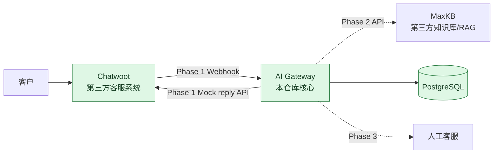

# Architecture — Phase 1

## 1. 目标与范围

Enamel AI Platform 是面向珐琅锅企业业务的 AI 应用集成 PoC。第一条计划链路是“客户消息 → 客服系统 → AI Gateway → 知识库/RAG → 客服系统”，并在不确定或高风险场景转人工。

Phase 0 建立工程底座；Phase 1 增加 Chatwoot Webhook、Conversation 基础持久化与 Mock AI 回帖，不接入知识库、LLM 或人工接管。

## 2. 组件关系



Phase 1 已实现 Chatwoot → Gateway Webhook 和 Gateway → Chatwoot API 的集成边界；MaxKB 与人工客服仍为后续阶段边界，不代表已实现。

## 3. Gateway 结构

```text
apps/gateway/
├─ src/
│  ├─ app.ts          # Express 应用工厂与 /health
│  ├─ server.ts       # 进程启动入口
│  ├─ config/env.ts   # 环境变量解析
│  ├─ api/            # 轻量 HTTP controller
│  ├─ services/       # Webhook 处理与 Mock AI 流程
│  ├─ clients/        # Chatwoot API Client
│  └─ repositories/   # PostgreSQL Conversation 存取
└─ tests/
   ├─ health.test.ts
   ├─ chatwoot-webhook.test.ts
   └─ chatwoot-client.test.ts
```

Phase 1 使用 `controller → service → client/repository` 分层。MaxKB 与 Handoff 模块尚未创建，避免用占位代码暗示功能已完成。

## 4. 关键决策

### ADR-0001：Gateway 为独立维护边界

Chatwoot 和 MaxKB 作为独立第三方服务使用 API 集成；不复制、不 fork 后魔改其核心源码。这样可以清晰说明项目自身贡献，也降低上游升级和许可证混淆风险。

### ADR-0002：单体 Gateway，暂不拆微服务

面试 PoC 优先可读性与可演示性。Gateway 采用单个 Node.js/TypeScript 服务，避免 Kubernetes、Redis 集群、多 Agent 或复杂权限系统。

### ADR-0003：`/health` 只表达进程存活

Phase 0 的 `GET /health` 是 liveness endpoint，不查询 PostgreSQL。数据库就绪状态由 Compose healthcheck 独立验证。后续如需对外表达依赖可用性，再增加单独的 readiness endpoint，避免把存活和依赖健康混为一谈。

### ADR-0004：TypeScript strict + 应用工厂

`createApp()` 与网络监听入口分离，使 HTTP 行为可直接做集成测试，无需占用固定端口。TypeScript strict、lint、格式检查和测试构成最小质量门槛。

### ADR-0005：以消息方向阻断 webhook 循环

Gateway 仅接收 `event=message_created`、`message_type=incoming`、客户文本消息。Gateway 通过 Chatwoot API 发送的回复是 `outgoing`，再次回到 webhook 时会在解析层被安全忽略并返回 2xx，不会再次调用数据库或 Chatwoot API。

### ADR-0006：Phase 1 只使用 Mock AI

本阶段的响应固定为 `[Demo AI] 已收到您的问题：{message}`。这样可以验证 Chatwoot ↔ Gateway 往返、错误处理、超时与持久化，而不会提前引入 MaxKB、LLM 费用或 Human Handoff 业务规则。

## 5. 数据边界

Phase 1 创建 `conversations` 表，保存 `id`、`chatwoot_conversation_id`、`contact_id`、`mode`、`created_at`、`updated_at`。对于同一 Chatwoot conversation，使用唯一键 upsert 保持最新联系人与更新时间。`ai_runs`、`handoff_events` 与 `knowledge_gaps` 仍留待对应业务阶段设计。

所有真实 API Key、Token 和密码必须由本地 `.env` 或部署环境注入；仓库只保留无敏感信息的 `.env.example`。
