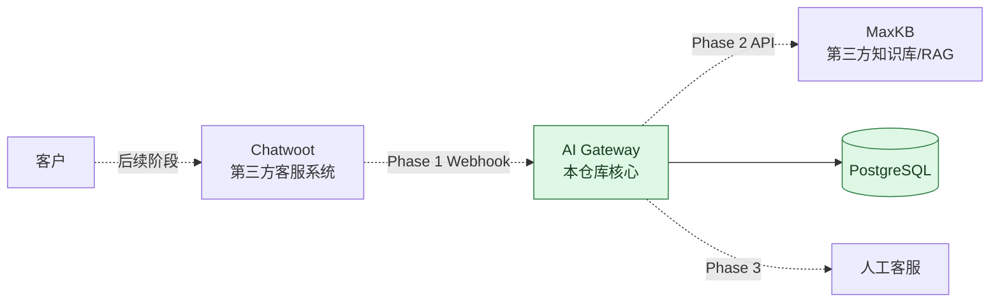

# Architecture — Phase 0

## 1. 目标与范围

Enamel AI Platform 是面向珐琅锅企业业务的 AI 应用集成 PoC。第一条计划链路是“客户消息 → 客服系统 → AI Gateway → 知识库/RAG → 客服系统”，并在不确定或高风险场景转人工。

Phase 0 只建立可验证的工程底座，不实现任何业务集成。

## 2. 组件关系



实线表示 Phase 0 已编排的组件关系；虚线表示后续阶段边界，不代表已实现。

## 3. Gateway 结构

```text
apps/gateway/
├─ src/
│  ├─ app.ts          # Express 应用工厂与 /health
│  ├─ server.ts       # 进程启动入口
│  └─ config/env.ts   # 环境变量解析
└─ tests/
   └─ health.test.ts
```

后续阶段按 `controller → service → client/repository` 分层添加代码。Phase 0 不创建空的 Chatwoot、MaxKB 或 Handoff 模块，避免用占位代码暗示功能已完成。

## 4. 关键决策

### ADR-0001：Gateway 为独立维护边界

Chatwoot 和 MaxKB 作为独立第三方服务使用 API 集成；不复制、不 fork 后魔改其核心源码。这样可以清晰说明项目自身贡献，也降低上游升级和许可证混淆风险。

### ADR-0002：单体 Gateway，暂不拆微服务

面试 PoC 优先可读性与可演示性。Gateway 采用单个 Node.js/TypeScript 服务，避免 Kubernetes、Redis 集群、多 Agent 或复杂权限系统。

### ADR-0003：`/health` 只表达进程存活

Phase 0 的 `GET /health` 是 liveness endpoint，不查询 PostgreSQL。数据库就绪状态由 Compose healthcheck 独立验证。后续如需对外表达依赖可用性，再增加单独的 readiness endpoint，避免把存活和依赖健康混为一谈。

### ADR-0004：TypeScript strict + 应用工厂

`createApp()` 与网络监听入口分离，使 HTTP 行为可直接做集成测试，无需占用固定端口。TypeScript strict、lint、格式检查和测试构成最小质量门槛。

## 5. 数据边界

Phase 0 只启动 PostgreSQL，不创建 `conversations`、`ai_runs`、`handoff_events` 或 `knowledge_gaps`。这些表应在对应业务阶段根据实际访问路径设计迁移，避免先写未经验证的 Schema。

所有真实 API Key、Token 和密码必须由本地 `.env` 或部署环境注入；仓库只保留无敏感信息的 `.env.example`。
