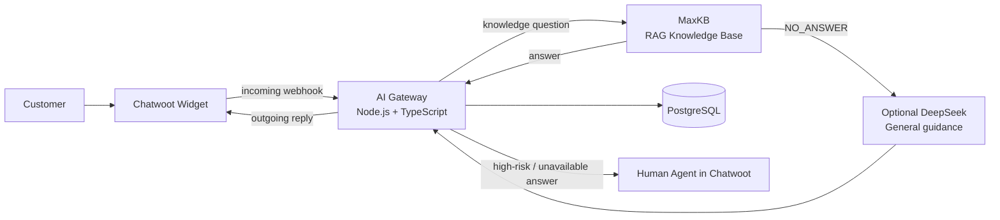

# Enamel AI Platform — Interview Architecture

> This repository is an interview PoC built with **Synthetic Demo Data**. It does not represent a real company, product specification, warranty, refund, compensation, or legal policy.

## Purpose

Enamel AI Platform demonstrates how to combine mature open-source customer-service and RAG products with a small, owned integration layer. The point is not to rebuild Chatwoot or MaxKB; it is to show an enterprise-safe boundary for message processing, persistence, policy routing, observability, and handoff.

## Routing policy

1. Gateway accepts only customer-created, incoming text messages.
2. High-risk topics (injury, compensation, refund, legal responsibility, major quality complaint) and explicit requests for a human agent are routed to `HUMAN` **before** any AI call.
3. Normal questions go to MaxKB first. Its application prompt must return exact `NO_ANSWER` when the retrieved knowledge cannot support the requested product fact.
4. Only `NO_ANSWER` may use the optional DeepSeek fallback. That fallback is limited to cautious, general guidance and must not invent product details or policy.
5. If DeepSeek is not configured or fails, the Gateway records a knowledge gap and hands the conversation to a human.
6. MaxKB network/API failures do not fall through to DeepSeek; they use the controlled failure/handoff path instead.

## Ownership boundaries

| Area                                                                                        | Owner                        | Why                                               |
| ------------------------------------------------------------------------------------------- | ---------------------------- | ------------------------------------------------- |
| Customer Widget, inbox, agents                                                              | Chatwoot                     | Mature open-source conversation platform          |
| Retrieval and knowledge-base application                                                    | MaxKB                        | Mature open-source RAG capability                 |
| Webhook filtering, API adapters, routing policy, idempotency, persistence, handoff, metrics | This repository's AI Gateway | Business-specific integration and safety boundary |
| Conversation, audit, handoff, and knowledge-gap records                                     | PostgreSQL                   | Simple durable state for the PoC                  |

The repository integrates Chatwoot and MaxKB by API. It neither copies nor modifies their core source code. See [THIRD_PARTY_NOTICES.md](../THIRD_PARTY_NOTICES.md) for attribution.

## Reliability and safety controls

- Database-backed webhook idempotency: duplicate `message_id` deliveries return 2xx without another model call or outgoing reply.
- Incoming-only webhook filtering prevents Chatwoot outgoing replies from creating an infinite loop.
- PostgreSQL advisory locking serializes MaxKB session initialization for one Chatwoot conversation.
- Versioned SQL migrations are tracked in `schema_migrations`; repeated runs are safe and preserve existing data.
- MaxKB retries at most once and only for transient errors (timeout, network, 408, 429, 5xx).
- Internal operational routes require `Authorization: Bearer <INTERNAL_API_TOKEN>` and fail closed when it is missing.
- Logs intentionally exclude Authorization headers, API keys, passwords, full webhook payloads, questions, and answers.

## Demo evidence

- `GET /health` proves the Gateway is running.
- A normal cookware question demonstrates Chatwoot → Gateway → MaxKB → Chatwoot.
- A high-risk question demonstrates direct HUMAN routing.
- A knowledge-gap question demonstrates `NO_ANSWER`, optional DeepSeek fallback, or human handoff when no fallback is available.
- Internal statistics and knowledge-gap routes demonstrate the durable audit trail without exposing conversation content or credentials.

## Local demo entry points

- Customer entry: `http://localhost:3002/widget?website_token=<website-token>`
- Chatwoot admin: `http://localhost:3002`
- MaxKB admin: `http://localhost:8080/admin/home`
- Gateway health: `http://localhost:3000/health`

For a LAN demo, use the host's current private-network IP instead of `localhost`. This is a local demonstration setup, not a public Internet deployment.

## What remains outside the PoC

Production needs SSO/RBAC, a private network or reverse proxy, secrets management, PII retention/masking policy, queues, high availability, monitoring/alerting, CRM/ERP integration, and a formal knowledge-review workflow.
